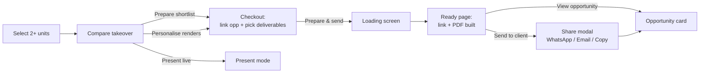

# Bricly — Compare & Shortlist Flow

Handoff spec for the **Compare Units → Prepare & Send Shortlist** flow, as implemented in the prototype
(`prototypes/Bricly_OS_Prototype_v2.html`). Written for both design and development.

---

## 1. Purpose & summary

A rep selects 2+ units anywhere in the CRM, compares them side by side (with a buyer-type lens),
optionally compares the **developments** visually, then prepares a client-ready **shortlist**
(interactive link and/or PDF), links it to an opportunity, and sends it — all without leaving the flow.



---

## 2. Entry points

| Entry | Behaviour |
|---|---|
| Units page — multi-select tray | Select 2–5 units → **Compare (n)**. Opens the compare takeover. |
| Opportunity → "Add units" flow (`sbUnitsAddToOpp`) | Jumps straight into **checkout** mode with the opportunity pre-linked and budget pre-filled from base prices. |
| Guard | Fewer than 2 units → toast *"Select at least 2 units to compare"*; compare never opens. |

The multi-select bar is **hidden** while any takeover is open (selection-bar refresh early-returns when a
`.tk.on` element exists).

---

## 3. Compare screen — "Compare units" view (default)

Full-screen takeover (`#cmp`, z-index 80). Header shows `{n} units selected`. Body scrolls
(`.cmp-body` is `display:block; overflow-y:auto`).

### 3.1 Sticky toolbar (all white, full-bleed)

Sticks to the top of the scroll area, edge-to-edge white with a hairline bottom border.

- **Compare for** — buyer lens pills: `All-round` (default) · `Investor` · `First home` · `Relocation` · `Second home`.
  Each lens re-orders row groups and highlights its key rows; a hint strip below explains the lens.
  Lens is a *view aid only* — never persisted to the contact.
- **Floor plans | Renders** — segmented control for the media block on each column. **Floor plans is default.**
- **Differences only** — toggle; hides rows where all units have identical values.

### 3.2 Unit columns (`.cmp-col`, responsive `flex:1 1 280px; min-width:250px`)

Top to bottom:

1. **Media block** (`.cmp-render`)
   - Plan mode: schematic floor plan SVG (`unPlanSVG`), click → fullscreen floor-plan compare.
   - Render mode: development photo, click → fullscreen unit-renders compare.
   - Chips overlaid on the image, both styled identically (9.5px pill):
     - bottom-right: `Tap to expand ↗` (passive hint)
     - bottom-left: `⇄ Compare renders` (**active** — switches the whole card to the dev-compare view;
       `stopPropagation` so it never triggers the expand)
2. **Unit id**, development + locality, **signal chips**: `New this week` (≤7 days on market),
   `Only {n} left here` (≤3 available in dev), `On hold — expiring`, readiness chip.
3. **Spec rows**, grouped: *Pricing* (base price, €/m² ★min, vs dev average, est. gross yield ★max
   investor-only, payment plan) · *Unit & layout* (type, beds/baths, floor, internal m² ★max, outdoor ★max,
   views, ready, status pill) · *Development* (delivery, amenities, available in dev ★max, development size —
   only when units span >1 dev) · *Location* (locality, getting around).
   ★ = best value in row gets a star + highlight. Remove a unit via the column `×` (below 2 units → toast + close).
4. **Development gallery strip** (`.cmp-devgal`) — thumbnails of that dev's renders/photos.
   **Any thumbnail click opens the fullscreen development compare** (section 5).
5. **Price** total row, and **Open unit** — opens the unit detail drawer *above* the takeover
   (z-index 95/96) including a development card (photo, about, amenities, distances), so the rep never leaves compare.

### 3.3 Footer (compare mode)

`{n} units · €total shortlist total` + actions:
`Keep browsing` (ghost) · `Present live` (ghost → Present-mode compare, no opportunity needed) ·
`Personalise renders` (ghost → checkout with intent *personalise*) · **`Prepare shortlist →`** (primary → checkout).

---

## 4. Compare screen — "Compare renders" view

Toggled via the `⇄ Compare renders` chip on any unit column. Toolbar collapses to a single hint line;
switch back via `⇄ Compare units` chip on any dev card.

One column per **distinct development**:

- Large exterior render (h 150) with `Tap to compare ↗` + `⇄ Compare units` chips → fullscreen dev compare.
- Dev name, locality · delivery; chips listing which selected units belong to this dev.
- 3-shot grid: **Entrance / Entrance interior / Exterior detail** (consistent slots, see 5.1).
- Fact rows: *Development* — Delivery, Size (units total), Available (x of y), Avg €/m² (rounded),
  Amenities (top 3) · *Location* — Locality, Getting around (top 2 distances).
- **From €{min available price}** total row + **View full gallery** button → fullscreen individual gallery.

---

## 5. Fullscreen compare popup (`#cmpPfs`, z-index 120)

One overlay, four modes. Dark header: title, subtitle, **segmented toggle (top-right)**, `Close ✕`.
`Esc` closes (after the share modal, before the compare takeover).

### 5.1 Consistent development shots

To make devs comparable, every dev resolves the **same 4 labeled slots** (`cmpDevShots`):

| Slot | Source | Fallback |
|---|---|---|
| Exterior render | `media.renders.ext[0]` | dev cover photo |
| Entrance | `media.photos[0]` | dev cover photo |
| Entrance interior | `media.renders.int[0]` | dev cover photo |
| Exterior detail | `media.photos[1]` | dev cover photo |

### 5.2 Modes

| Context | Toggle options | Layout |
|---|---|---|
| Units — **Floor plans** | `Floor plans` / `Renders` | One card per unit: caption (id · dev · type · m²) + large plan SVG. |
| Units — **Renders** | `Floor plans` / `Renders` | One card per unit: caption + the 4 labeled shots stacked (scrollable). |
| Devs — **Compare developments** | `Compare developments` / one button per dev | One card per dev: caption (name · locality · delivery · unit count) + the same 4 labeled shots — like-for-like comparison. |
| Devs — **Individual gallery** (e.g. "Dolphin Court") | same toggle | **Split layout**: left — *all* renders & photos of that dev, large (max-height 72vh, captions); right — **overview panel** (330px): name, locality · delivery, About, Key facts (delivery, size, available, avg €/m², from-price), amenity chips, getting-around distances. |

Entry wiring: plan click → Units/Floor plans · render image click → Units/Renders · dev photo or
gallery thumb → Devs/Compare developments · "View full gallery" → Devs/Individual gallery.

---

## 6. Checkout — "Prepare shortlist for client"

Heading: *"Prepare shortlist for client — {n} units"* (personalise intent:
*"Personalise {n} units — link an opportunity first"*).

### 6.1 Opportunity card (link picker)

Single search input over **opportunities** (open, mine unless manager) and **contacts** (lead/buyer),
max 4 each, live dropdown:

- Pick an **opportunity** → chip `{lead} · {id} · {stage} · {rep}` with `Change`.
- Pick a **contact** → "New opportunity — {name}" chip + Budget (€k) field (pre-filled from contact `bmax`).
- **`+ Add "{query}" as a new contact`** → inline mini-form (name required, phone/email optional) + budget field.
  Contact **and** opportunity are created at prepare time.

### 6.2 What to prepare (deliverables)

Two selectable cards (radio-style check circles), both **on** by default; at least one required:

- **Shortlist link** — interactive landing page (floor plans, renders, prices).
- **Shortlist PDF** — branded brochure, one page per unit.

### 6.3 Units in this shortlist

Read-only rows: unit id · development · price.

### 6.4 Footer & validation

`Shortlist total €…` · `Back to compare` (ghost) · **`Prepare & send →`** (primary).

The primary button is **greyed out and unclickable** (`opacity .45`, no pointer events) until:
1. an opportunity/contact/new-contact is linked, **and**
2. ≥1 deliverable is selected (personalise intent skips rule 2).

If somehow triggered anyway, guard toasts: *"Link an opportunity or contact first"* /
*"Pick at least one deliverable to prepare"* / *"Add the contact name first"*.

### 6.5 CRM writes at prepare

- Opportunity mode: attach the selected units + devs to the opportunity.
- Contact mode: create `OPP-10xx` (stage **Qualified**, source = contact's source), push to `contact.oppIds`.
- New mode: create full contact record (`CT-3xx`, type lead, generated email/phone if blank, budget) + the opportunity.
- Personalise intent: seed the custom-pack studio with these units, log a system comm, open the studio; flow ends here.

---

## 7. Loading screen (~1.6 s)

Spinner + *"Preparing shortlist for {lead}…"* with staggered check steps (only for chosen deliverables):

1. Building the landing page
2. Rendering the PDF brochure
3. Writing the client message

Footer shows only *"Preparing…"*. On completion the shortlist asset is logged on the opportunity as
**"Unit shortlist — Generated just now · not yet sent"** plus a system comm
(*"Shortlist link + PDF generated — {n} units, total €…"*).

## 8. Ready page — "Shortlist ready for {lead}"

- **Deliverables** card (only the chosen ones):
  - **Landing page** — `bricly.mt/s/{opp-id}` · `View` · `Copy link`
  - **Shortlist PDF** — `{firstname}-shortlist.pdf · {n} units` · `View` · `Download`
- **Linked opportunity** card — lead, id · stage, shortlist total + the unit rows.
- Note: *"Everything is saved to the opportunity under 'Shared with client' — send it now, or come back to it later."*
- Footer: `View opportunity` (ghost — clears selection, closes compare, opens the opportunity card)
  · **`Send to client →`** (primary — opens share modal).

## 9. Share modal ("Review & share", z-index 95)

- Deliverable rows (chosen ones only) with View/Copy/Download.
- **Message to send** — editable textarea, pre-seeded:
  *"Hi {first}, here's a shortlist of {n} units I've put together for you — take a look and let me know your thoughts."*
- **Send via** — `WhatsApp` / `Email` / `Copy link`; submit label follows: *"Send via WhatsApp →"* / *"Copy & save →"*.
- `← Back` returns to the ready page (modal closes, nothing lost).

### On send

1. Shared asset upgrades to **"Sent just now · not yet opened"** (engagement tracking hook).
2. Outbound comm logged (WhatsApp/Email) with message + link.
3. System comm: *"Shortlist sent via {channel} — {n} units ({ids}), {link + PDF}, total €…"*.
4. Selection tray cleared, compare closes, pipeline re-renders, **opportunity card opens**,
   toast *"Shortlist sent to {first} via {channel}"*.

---

## 10. Interaction & layering rules

| Layer | z-index |
|---|---|
| Compare takeover `#cmp` | 80 |
| Lightbox | 90 |
| Share modal / unit-peek scrim over takeover | 95 |
| Unit peek drawer over takeover | 96 |
| Fullscreen compare popup `#cmpPfs` | 120 |

**Escape order:** share modal → fullscreen popup → unit peek / other drawers → compare takeover.
Clicking the share-modal backdrop closes it.

---

## 11. State & key functions (dev reference)

```js
cmpState = {
  mode: 'compare' | 'checkout' | 'loading' | 'ready',
  view: 'units' | 'renders',          // column layout
  lens: 'all' | 'investor' | 'firsthome' | 'relocation' | 'secondhome',
  diffOnly: bool, media: 'plan' | 'render',
  intent: 'send' | 'personalise',
  link: null | {mode:'opp',oppId} | {mode:'contact',ctId} | {mode:'new',name,phone,email},
  linkQ: '', budget: null,            // €k
  sendLink: true, sendPdf: true,      // deliverable selection
  shareMsg: '', channel: 'wa'|'em'|'copy',
  _oppId, _sharedRef                  // set during prepare
}
cmpFs = { ctx:'units'|'devs', mode:'plans'|'renders'|'devs'|'gallery', devId }
```

| Function | Role |
|---|---|
| `cmpOpen / cmpClose / cmpRender` | Takeover lifecycle; render branches on `mode`. |
| `cmpColsHtml / cmpColHtml / cmpDevColHtml` | Unit vs development columns. |
| `cmpActivePlan / CMP_ROWS / CMP_LENSES` | Derived comparison rows, lens ordering, best-value stars. |
| `cmpDevShots / cmpFsOpen / cmpFsSet / cmpFsRender` | Fullscreen popup engine (4 modes). |
| `cmpLink*` | Opportunity/contact picker incl. inline create. |
| `cmpPrepare` | Validation, CRM writes, loading → ready staging. |
| `cmpOpenShare / cmpShareSend / cmpViewOpp` | Share modal, send effects, exit to opportunity. |
| `cmpPeekUnit` | Unit drawer above the takeover. |
| `cmpPresent / cmpPersonalise` | Hand-offs to Present mode / custom-pack studio. |

## 12. Design notes

- Tokens: primary `#657A32`; pills/chips use `--outline`/`--outline-variant`; popup cards on dark use `#fdfcf9`.
- The two media-chip styles are identical (`.plan-hint`), active variant adds hover (primary border/text) + pointer.
- Disabled primary button: `opacity .45; pointer-events none` — same geometry, no layout shift.
- Naming is standardised on **"Shortlist"** everywhere (link, PDF, buttons, comms). Never "deal" — always "opportunity".

## 13. Edge cases

- Removing units mid-compare below 2 → toast + compare closes (selection kept for the last unit).
- Devs with missing media: every gallery/compare slot falls back to the dev cover photo; broken images self-hide.
- `Copy link` channel maps to WhatsApp channel-metadata for logging but shows "Copy & save →".
- Budget defaults: contact `bmax` → else shortlist total (rounded to €50k steps for opportunity budget).
- Back-navigation never loses state: checkout ↔ compare keeps selections; share modal ↔ ready page keeps message/channel.
