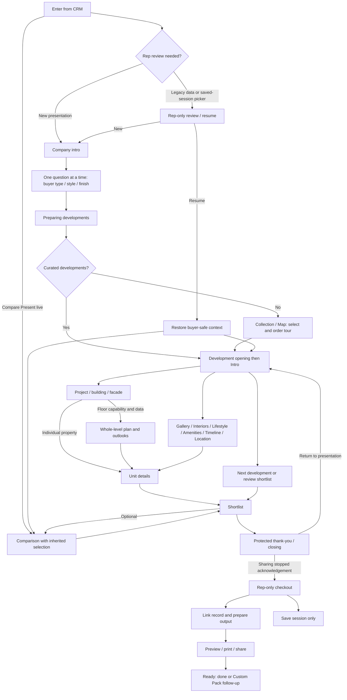

# Bricly Present Mode — full product, design and development flow

**Version:** 1.0 · **Date:** 10 September 2026  
**Audience:** product owner, product designer, frontend/backend developers, content/CGI team and QA  
**Status:** consolidated requirements for full design and implementation planning; production dependencies and unresolved decisions are explicitly identified below.

> **Read this first:** this is the end-to-end experience brief to share with the designer and development team. The interactive prototype demonstrates the agreed interactions, not production-ready project data, security, asset ingestion or delivery services. Buildings, level geometry, outlooks and neighbourhood places are currently illustrative. A real test project will be supplied later.

## Contents

1. [Purpose, authority and scope](#1-purpose-authority-and-scope)
2. [Users, language and design principles](#2-users-language-and-design-principles)
3. [Complete journey](#3-complete-journey)
4. [Entry routes and inherited context](#4-entry-routes-and-inherited-context)
5. [Screen-by-screen requirements](#5-screen-by-screen-requirements)
6. [Navigation and state rules](#6-navigation-and-state-rules)
7. [Data, assets and content contracts](#7-data-assets-and-content-contracts)
8. [Inventory, pricing and comparison rules](#8-inventory-pricing-and-comparison-rules)
9. [Responsive design, accessibility and motion](#9-responsive-design-accessibility-and-motion)
10. [Loading, error and recovery states](#10-loading-error-and-recovery-states)
11. [Implementation boundaries and production work](#11-implementation-boundaries-and-production-work)
12. [Designer deliverables](#12-designer-deliverables)
13. [Engineering work packages](#13-engineering-work-packages)
14. [Acceptance criteria and QA](#14-acceptance-criteria-and-qa)
15. [Open decisions and sign-off](#15-open-decisions-and-sign-off)

## 1. Purpose, authority and scope

### 1.1 Product outcome

Turn a buyer meeting into a guided, visually rich property exploration. A sales rep can introduce the developer company, understand the buyer's preferences, tour selected developments, explore buildings and residences, collect a shortlist, compare choices and prepare the right follow-up without exposing internal CRM information.

The experience must support both:

- **A guided conversation:** a curated, ordered tour of developments with a clear next step.
- **Buyer-led exploration:** jump into a building, level, view, neighbourhood or unit without losing context.

Successful completion does not require a sale, a contact record, a comparison or a render request. Saving an anonymous session or development-only interest is valid.

### 1.2 Which document to use

| Resource | Purpose |
| --- | --- |
| This document | Current full experience requirements and design/build acceptance brief |
| [Present Mode v2 implementation and QA](present-mode-v2.md) | Exact implemented APIs, prototype schemas, known limitations and recorded tests |
| [Interactive v2 prototype](../prototypes/Bricly_OS_Prototype_v2.html) | Working interaction reference; serve over HTTP for local testing |
| [Compare & Shortlist flow](compare-shortlist-flow.md) | Existing CRM Compare context; not authority for contradictory Present safety or urgency copy |
| [Earlier Present Mode overview](Present-Mode-Overview.md) | Historical direction only; not the current requirements |

For this Present Mode handoff, the requirements here supersede earlier ideas of live configuration/price editing in the buyer tour, immediate Escape-to-CRM, universal 3D orbit and fabricated urgency. Do not remove existing CRM Compare or Custom Pack functionality as part of applying this brief.

### 1.3 Requirement labels

- **Required:** confirmed experience/behavior to retain in the full design.
- **Conditional:** required when the corresponding approved data or capability exists.
- **Prototype:** current demonstrator behavior or implementation detail, not a production guarantee.
- **Proposed production requirement:** recommended engineering/design behavior requiring estimation and approval, not a service already implemented.
- **Decision needed:** unresolved choice; do not silently turn it into a committed feature.

### 1.4 Included and excluded

**Required experience:** company arrival; sequential buyer preferences; portfolio selection/map; ordered tour; development Intro; Project/buildings/facades; conditional Floors and level outlooks; narrative/media sections; interactive Location; unit details and visual previews; temporary plan markup; shortlist; shared comparison; protected closing; rep-only preparation/sharing; Custom Pack follow-up.

**Not part of the current demonstrated build:** project upload/import UI, real asset processing pipeline, production authentication or backend persistence, real inventory subscription service, public buyer-link hosting, server-generated PDFs, actual email/WhatsApp delivery, real map/POI provider integration, a separate presenter display, casting or live AI/render generation.

True 3D/free orbit is **optional future capability**, not a mandatory substitute for approved discrete facade views. Structural/layout editing, reservation/payment execution and saved/shared plan annotations are outside this flow.

## 2. Users, language and design principles

### 2.1 Users and visibility

| User/context | Needs | Visibility rule |
| --- | --- | --- |
| Sales rep before meeting | Choose/resume session, resolve legacy configurations, inherit buyer context | Rep-only preparation; do not screen-share this UI |
| Rep presenting with buyer | Navigate confidently, answer questions, collect interest | Buyer-safe content only, even if the rep operates the screen |
| Buyer during meeting | Understand the development and differences, explore without pressure | No unrelated contacts, CRM notes, internal pricing or pipeline data |
| Rep after sharing stops | Link records, prepare deliverables, follow up | Explicit acknowledgement unlocks rep-only checkout |
| Buyer viewing a prepared output | Review only approved, selected content | Read-only output; no CRM/session editing capabilities |
| Content/admin team | Supply approved project assets and mappings | Separate future preparation workflow, not part of the live tour |

### 2.2 Vocabulary

- **Company intro:** developer-company arrival before preference questions.
- **Development opening:** short, skippable identity transition on first visit.
- **Intro:** left-rail development screen containing its hero image or project film.
- **Project:** spatial site/building/facade explorer. This replaces the visible label **Exterior**.
- **Floor / level:** an entire building level, including multiple units and shared spaces, not an individual unit's plan.
- **Unit / residence / property:** saleable inventory item; may be an apartment or a whole villa.
- **Saved specification:** canonical unit configuration already held in the selection/CRM.
- **Visual preview:** an available render variant being browsed; not a configuration change.
- **Tour selection:** developments to visit. **Shortlist:** explicit buyer interest to retain/follow up.

### 2.3 Design direction

Required: preserve Bricly's existing typography, sage accents, Sandstone/light and Blackstone/dark surfaces, spacing and component language. Aim for an Apple-like sense of clarity, restrained motion and generous imagery—not a copy of another product's branding.

- Use immersive media, with quiet controls and a clear primary action.
- Use liquid-glass-inspired surfaces selectively; always provide readable opaque fallbacks.
- Conversational entry should feel personal and futuristic without pretending a live AI is reasoning or generating content.
- Do not put large title/body overlays across Interiors or gallery images. Keep captions outside imagery.
- Keep important status and provenance concise but visible. Do not bury demo/illustrative disclosure.
- Provide labels alongside meaningful icons. Status must never depend on colour alone.
- Show source-backed facts, not invented floor dimensions, views, ownership, demand, urgency or travel times.

## 3. Complete journey

The diagram summarizes destinations, not every Back path. Exact restoration rules are in section 6. Resume may restore Portfolio, Unit, Shortlist or another valid buyer stage—not necessarily Intro.

### 3.1 Core stories the design must demonstrate

1. **Anonymous exploration:** choose preferences → select two developments → inspect several units → shortlist → end safely → create/link a contact after the meeting.
2. **Known buyer:** inherit saved preferences/configurations → skip answered questions → present the curated development → return to an existing shortlist.
3. **Building-led discovery:** Intro → Project → choose building → hover a level → open whole-level plan → inspect unit → Back to exact level.
4. **Villa discovery:** Intro → Project → inspect a saleable property via an approved mapping or Units list; no irrelevant Floors controls.
5. **Neighbourhood-led discovery:** Location → filter schools/transport/leisure → inspect a point → reset map → return to project context.
6. **Follow-up:** compare shortlisted options → stop sharing → prepare shortlist → request Custom Pack work without overwriting an existing draft.

## 4. Entry routes and inherited context

| Entry | Initial context | Required route |
| --- | --- | --- |
| Sidebar Present | No required buyer/development | Rep session picker if needed; otherwise company intro and optional questions → portfolio |
| Development detail | Selected development | Setup → preparing → development opening → Intro |
| Developments multi-select | Ordered chosen developments | Setup → first development; retain order |
| Opportunity | Linked buyer, selection, notes, canonical config, explicit preferences | Resume an open linked session where offered, or begin curated tour |
| Appointment/prep | Linked opportunity if confidently identified | Same known-buyer flow; do not infer identity from an ambiguous match in production |
| Existing Compare → Present live | Selected units, configurations and current buyer lens | Enter buyer-safe comparison directly; do not force setup again |
| Saved session | Last valid buyer context and selection | Restore without revealing rep checkout automatically |

**Rep review:** show any legacy/imported configuration ambiguity before buyer sharing. Preserve the original values; do not silently reinterpret old field labels as approved specifications. Production needs a deliberate reconciliation decision, not the prototype's default-configuration acknowledgement as a business policy.

**Inheritance:** use explicit saved answers only. An answered “No preference” is different from an unanswered field. Cancelling setup must not mark unanswered defaults as confirmed. No hashed/demo buyer classification counts as a known preference.

## 5. Screen-by-screen requirements

### PM-01 — Company arrival

**Purpose:** introduce the developer company and begin the conversation.

- Show supplied company name/logo and optional tagline, with restrained conversational/loading motion.
- Do not substitute an individual development's identity for the company.
- Include “Let’s begin” to bypass the short arrival animation.
- With no configured identity, use neutral wording rather than inventing company ownership.
- This screen must already be buyer-safe. Back/Escape must not expose the CRM.
- Reduced motion must avoid forced animation delays.

**Exit:** first unanswered setup question; if all answers are already known, Preparing developments.

### PM-02 — Set the scene / edit preferences

**Required order:** buyer type → visual style → preferred finish. Display **one question at a time**.

| Question | Content | Behavior |
| --- | --- | --- |
| What brings you here? | General/just exploring, investment, relocation, first home, second home | Select answer → advance |
| What feels like you? | Named supplied style palettes | Select answer → advance |
| Which finish draws you in? | Named finish/material palettes | Select answer → preparation or return to tour |

- Show question progress and Back; include Skip/General or No preference.
- Answers auto-advance without an extra Continue button.
- Inherited answers are skipped on forward entry. Back may revisit them.
- Cards are material/style palettes, not generated previews of the chosen residence.
- Preferences affect prioritization/available visual variants, never saved layout, finish pack or price.
- Editing during the tour returns to the exact originating screen/media context when finished.
- Announce the new question and move focus to its heading. Prevent accidental double activation from skipping questions.

### PM-03 — Preparing developments

- Use the copy **“Preparing developments”**.
- Prepare the selected project's initial assets and portfolio data; do not imply render generation.
- Bound loading, support failure fallback and cancellation, and do not impose a long decorative spinner.
- Preserve selection and answers if an asset fails. Continue with supported content.
- Invalidate callbacks if the user leaves or changes session; a delayed load must not reopen the tour after End.

**Exit:** selected tour's first development, otherwise Portfolio.

### PM-04 — Portfolio: Collection / Map

**Collection:** development image cards with name, location, completion, available registered inventory and permitted price information. Whole-card multi-selection must be obvious.

**Map:** development results and filters on the **left**, interactive development map on the **right**. On narrow screens, stack or provide clearly linked panels without duplicating selection state.

- Cards, results and map markers toggle the same selected development IDs.
- Show selection order; allow reorder and remove before Start tour.
- Filters may include development, bedrooms, property type, price, view, completion and availability where supported.
- A filter never deletes a selection, even if the selected project is no longer visible.
- Empty results: explain and offer Reset. Map failure: list/selection remains usable.
- Start tour requires at least one development. Shortlisting a unit is not required.
- Do not treat selecting a development for the tour as shortlisting it for follow-up.

### PM-05 — Development shell and tour navigation

**First visit:** optional short, skippable **development opening** (supplied logo or labelled monogram transition) → development **Intro** (hero/film). **Default right panel: Units**, not Overview.

| Left-rail item | Purpose | Visibility |
| --- | --- | --- |
| Intro | Hero image or project film | Always; informative fallback if neither asset exists |
| Project | Site/building selection and facade exploration | Always; imagery/list fallback if spatial assets unavailable |
| Floors | Complete level plans and level outlook access | Only for floor-enabled projects/buildings with appropriate data |
| Lifestyle | Buyer-relevant narrative and supplied facts | Content-dependent, with explicit missing state |
| Interiors | Interior gallery, no central text overlay | Supplied gallery or honest empty state |
| Gallery | All relevant project media | Supplied gallery or honest empty state |
| Amenities | Complete supplied amenity list | Never fabricate missing amenities |
| Timeline | Supplied milestones and completion | Completion-only fallback when appropriate |
| Video | Dedicated film playback | Current prototype offers this when a film exists; final redundancy with Intro is a design decision |
| Location | Interactive neighbourhood and POIs | Verified production map or labelled demo/fallback |

The top-level presentation chrome provides Developments, Preferences, Shortlist count, Hide/Show prices and End. Tour progress shows ordered stops, current development, introduced status, Next development and Review shortlist at the final stop.

- Users may revisit a development or return to Portfolio at any time.
- Re-entering via a tour stop opens that development's Intro; its stored building/floor exploration is retained for subsequent Project/Floors access.
- Unit Back and explicit session resume preserve the originating media rather than restarting Intro.
- Standard scenes retain Units/Overview. Floors uses a building/floor/unit inspector. Location can use full stage width. Units must remain accessible through a secondary drawer/list on constrained layouts.

### PM-06 — Development Intro

**Purpose:** establish the project's identity and atmosphere before spatial exploration.

- Full-stage hero image or supplied project video, development identity, location, completion and concise tagline.
- Primary action **Explore project**; secondary **Explore residences**.
- Video starts muted, inline, with accessible play/pause and sound controls. Autoplay is best-effort, never required for navigation.
- Reduced-motion preference disables automatic playback/looping; users can still choose Play.
- Preserve a hero poster while loading. Failed/unsupported video returns to the image with a quiet explanation.
- Keep video controls unobscured by the hero copy/gradient. Do not play audio automatically.
- Production film content needs rights, captions for meaningful speech, and an accessible alternative for important visual information.
- No film supplied: use the image. Do not show a fake Play button.

### PM-07 — Project: site → building → facade

#### Site / building selection

- Multi-building development: show the whole site with clearly selectable building footprints/hotspots and an equivalent named list.
- Single-building development: skip an unnecessary selector and enter its project view.
- Selecting a building preserves the overall development context and opens available facade views.
- Show Back to site/project when multiple buildings exist.
- Unit assignments must come from explicit production IDs; never join buildings by display names or infer membership from render filenames.

#### Facade navigation

- Offer previous/next viewpoint and named facade controls for **available** views only.
- Optional real 3D orbit requires a valid model, stable mapping and separately approved implementation. Discrete image/viewpoint navigation is a valid baseline.
- Do not reuse one generic photo as four purported real facades.
- Retain building, facade and selected floor when switching between Project and Floors.

#### Direct facade → level plan

- Where levels are mapped, hovering or keyboard-focusing a floor band highlights it and displays its level label and “Open floor plan” affordance.
- **Hover alone changes no selection or route.** Click/tap/Enter/Space opens that exact building's exact level.
- Activation enters **plan view**, even if a remembered floor view previously showed an outlook.
- Decorative doors, landscaping, shadows and labels must not block hit targets.
- Keep a touch-friendly floor list/button equivalent; narrow/high-rise bands cannot be the only means of selecting a floor.
- Do not make an unmapped facade region clickable. Explain unavailable level content without inventing geometry.

#### Villas / properties without floor navigation

- A saleable villa may physically have storeys without being sold as apartments by level. Floor exploration is a product capability, not a guess from `floor:0`.
- Hide Floors in the rail, floor bands, floor chips and Explore floors actions when the capability/data is absent.
- Keep Project, facade imagery, Units and property drill-down available. Approved property hotspots may open the whole property rather than an internal level.
- A mixed development requires per-building/property capability metadata in production; a development-wide villa test is not sufficient.
- If saved floor state becomes unsupported, return safely to Project, retaining the shortlist.

**Prototype:** all projects use two invented demo buildings and generated facade drawings. Floor capability currently derives from recorded levels, villa-only inventory and the explicit `presentSpatial.floorNavigation` override. Production must replace this with validated project/building capability and asset mappings.

### PM-08 — Floors: whole-level plan

**Layout:** centre stage shows the **entire selected level**, not a grid of individual unit plans. The inspector shows the property outline, highlighted selected floor, level navigation and selected-unit details.

- Whole-level geometry includes unit footprints and supplied shared areas/core/circulation.
- Colour/status badges identify availability, with unit IDs and text equivalents.
- Higher/Lower controls move through the explicit level registry. Support Ground, basements, mezzanines and non-contiguous labels/order without inventing intermediate levels.
- Building silhouette highlights the selected level. If true geometry is missing, use a labelled schematic rather than claiming accurate proportions.
- Pan/zoom and Fit; transformations apply to imagery and hotspots together.
- Selecting a footprint highlights it and opens details: unit ID, type, beds/baths, areas, floor, status, permitted configured price, Explore/Inspect and Shortlist.
- Only explicit Add to shortlist changes shortlist state. Hover, selecting a level or inspecting a unit does not.
- Held/reserved/sold/unknown-status units may be inspected read-only; cannot become actionable comparison/share inventory.
- Empty mapped level: show its valid plan where supplied and “No registered units”; do not call it sold out or available.
- Missing plan: retain floor navigation and an inventory list; show “Floor plan not supplied”. Do not stitch individual unit diagrams into a purported approved level plan.
- Explore unit opens the standard unit page. Back restores building, level, selected unit, display mode and viewport.

**Responsive:** selected floor and outline remain discoverable on tablet/mobile; unit actions must not vanish with the desktop sidebar.

### PM-09 — Views from this level

- Place the action alongside Whole-level plan; preserve the selected building and level.
- Show only available, correctly mapped direction/view assets. Label level, direction and source/provenance.
- Support image, approved panorama or supplied video according to actual media capability; do not imply 360° interaction for a still image.
- Direction navigation and fullscreen must not change the unit's saved plan, view specification or price.
- Return restores the same level plan. Missing outlook: “Views from this level not supplied”; no unrelated generic vista presented as actual.
- Do not infer north, sightlines, sea views or camera elevation from a filename or a unit marketing tag.

**Prototype:** generated directional outlooks explicitly say “Illustrative view · not an actual outlook”. They demonstrate navigation only and are excluded from buyer deliverables.

### PM-10 — Lifestyle, Interiors, Gallery, Amenities, Timeline

| Scene | Content and interaction | Key constraint |
| --- | --- | --- |
| Lifestyle | Concise narrative and relevant supplied facts, influenced by buyer lens | No invented financial forecast or persona-based claim |
| Interiors | Interior thumbnails → protected fullscreen gallery | No central image title/body overlay; captions outside images |
| Gallery | All eligible project media; browse thumbnails and fullscreen | Preserve source category/caption; do not invent shot labels |
| Amenities | Full list of supplied facilities/features | Distinguish project amenities from unit-specific inclusions |
| Timeline | Supplied actual/planned milestones and completion | No fabricated progress percentages or dates; completion-only state allowed |
| Video, if retained | Dedicated project film playback | Same playback/accessibility/fallback rules as Intro |

Approved matching variants may appear first; ordinary project imagery remains clearly labelled context, not an exact configured-unit render. Missing assets have stable empty/fallback states, not promises of automatic generation.

### PM-11 — Location: neighbourhood discovery

**Purpose:** understand the real surroundings and relevant nearby points without leaving the presentation.

- Interactive pan/zoom map with a persistent development anchor and category controls.
- Categories: transport, education, dining, shopping, health and recreation; extend only with supplied data.
- Pins and accessible results list share category/selection state. Selecting either highlights the point and opens the same details.
- POI card: verified name, category, concise relevant information and approved optional imagery/source details.
- Filter changes clear a selection that no longer matches. Reset to development clears filters, selects/recentres the development and fits the initial extent.
- No external navigation is required to inspect a place. Any future external directions link needs a buyer-safe handoff design.
- Distances must identify calculation method; travel times require a verified mode/provider and freshness policy. Do not derive them from arbitrary schematic coordinates.
- Keep proper attribution/licensing on any real map provider. Real-location service failure falls back to supported list/content, not fictional map pins silently replacing actual data.

**Prototype:** local schematic with ten explicitly fictional example POIs. It makes no geographic/routing/network requests. The separate Portfolio Malta map remains a different view and data boundary.

### PM-12 — Unit details and visual exploration

**Required content:** unit identity and development; type; bedrooms; bathrooms; floor; internal and outdoor area; views; completion/readiness; availability; saved specification and configured price; supplied room schedule, features, orientation and dimensions.

- Show complete available facts, not just a teaser. Unknowns read “Not supplied” or an explicit dash—not zero or a generated guess.
- A combined area, if shown, must be clearly defined; do not add incomparable/overlapping area measures.
- Room dimensions/areas come from verified unit data. A typology room list is not automatically correct for every unit.
- Main saved-specification plan is clickable for fullscreen pan/zoom and temporary drawing.
- Gallery shows all eligible unit renders, with honest distinction between exact-unit, typology and project-context imagery.
- Remove buyer-facing **Visual pending** cards/badges. Use useful actual imagery, a compact missing-image state and honest provenance instead.

#### Style / layout preview controls

- Provide named Style and Layout options next to the gallery; supported choices may be segmented controls or compact selectors.
- Enable only combinations backed by supplied approved assets for the unit/typology, layout, preset, saved pack and style.
- If a catalogue option is displayed without a matching asset, keep it visibly disabled and explain “No approved render for this combination” through touch/keyboard-accessible help, not a hover-only tooltip. The designer may omit irrelevant catalogue options, but must not imply they are selectable.
- Keep current room/image when a matching variant exists; otherwise select a valid image with clear provenance.
- Label **“Visual preview only — saved specification and price unchanged.”**
- Preview selection must not change `layout`, `preset`, `pack`, actual floor plan, saved price or shortlist membership.
- Never label a generic room image as a different layout just to make a toggle work.
- Custom specification changes and bespoke renders belong in Custom Pack after the meeting.

**Actions:** Add/remove shortlist, request note, open gallery/plan, Back. Unavailable units remain inspectable; no live configuration editing here.

### PM-13 — Protected fullscreen media and plan viewer

- Opens inside Present, not in a CRM lightbox or external editor.
- Next/previous images, thumbnails/count, captions/provenance, zoom, pan, Fit and Close.
- Gallery close retains selected image and restores focus to the invoking control.
- Plan tools: Pan, Draw, Undo, Clear marks. Fit resets only the viewport.
- Draw in source coordinates so marks remain aligned through pan/zoom/resize; pinch must not accidentally draw.
- Marks are **temporary only**: retain while reopening the same asset in the current presentation; clear on End, closing the presentation session or reload. Closing only the viewer does not clear them.
- Never save, export, print, share or pass marks to Custom Pack. No measurement or architectural editing claims.
- North indicator only when supplied bearing is valid. Generated level-outlook media is not an annotatable plan.
- Escape closes only the viewer. Inventory can reconcile in state, but must not replace the active viewer DOM during a gesture.

### PM-14 — Shortlist

**Full-screen destination**, grouped by development; not a cramped overlay.

Each unit card includes:

- Clickable **unit floor-plan thumbnail**—one per shortlisted unit, not invented per-room plans.
- Unit/development identity, beds, baths, size, floor, views and status.
- Saved configuration, permitted price, request note and explicit remove action.
- **Buyer interest:** Not set / Interested / Favourite, separate from status.
- **Market activity:** privacy-safe aggregate only, with source/meaning stated separately from buyer interest.

At development level show available registered units and registered inventory count. Show a total project size only when explicitly confirmed. Development-only shortlist items remain valid even if no unit is chosen.

- Selected-but-unavailable units stay as history, clearly excluded from actionable comparison/deliverables.
- Choose a comparison subset of **2–4 units** or **2–3 introduced developments**. Larger shortlists need not be discarded to fit columns.
- Unit and development comparison are optional. Continue to closing/checkout without comparison.
- “Interest” is not a reservation, hold, sale, demand score or pricing modifier.

### PM-15 — Compare units / developments

- One comparison destination with Units / Developments switch, buyer lens and Differences only.
- Use the same source facts and pure calculations as existing CRM Compare—not a separate reduced calculation model.
- Lens changes order/highlight of relevant facts, not the facts or configuration.
- Unit columns: identity, saved configuration, plan/gallery access, configured price and complete applicable comparison rows.
- Development columns: identity/imagery, location, delivery, available/registered/confirmed totals, permitted pricing metrics, supplied contextual facts and full amenity matrix.
- Amenity matrix uses all relevant amenities, not a three-item teaser: Included ✓ / Not listed — / explicitly Not included.
- Missing data must not win a comparison; equal best values must not imply one arbitrary winner.
- Price hiding applies to all financial rows and derived financial insights.
- Unit drill-down returns to the same mode/subset/lens/differences state.
- Keep original Compare selection and Custom Pack handoff intact; the existing tray can retain five items while a presentation compares up to four at once.

### PM-16 — End / protected closing

- End saves the session and opens a buyer-safe thank-you screen, including empty/anonymous sessions.
- Offer Return to presentation and **“Sharing stopped / screen turned back”**.
- Only that explicit acknowledgement permits rep-only checkout or return to the CRM.
- Escape/native fullscreen exit/browser Back must not unexpectedly reveal private UI.
- The app cannot know that Zoom/Teams/screen sharing has stopped; do not claim automatic detection.
- Ending clears temporary plan marks. Returning to the presentation does not resurrect them.

### PM-17 — Rep-only checkout and preparation

**Before preparation:** choose existing opportunity, existing contact or new contact. New contact requires a name; communication details are optional unless the chosen delivery channel needs them. Never infer consent.

- Review eligible selected units, development-only interest, exclusions and price mode.
- Select interactive shortlist and/or printable/PDF deliverable; optional comparison and developments considered.
- Allow Save session only without contact creation or deliverables.
- Preparing requires eligible content, a valid record choice and at least one deliverable.
- Prepare an immutable, explicit snapshot—not a dump of session/UI state.
- Inventory, canonical configuration, price mode or included content changes invalidate stale prepared output and require review/re-preparation.
- If linking creates a new opportunity, preserve the agreed initial sales stage and ownership rules; verify these with the CRM team before production.

**Prototype:** contact creation can create a Qualified opportunity; outputs are local snapshots and browser print. This is not a public link/PDF backend.

### PM-18 — Preview, share, Ready and Custom Pack

- Preview presents only selected, permitted buyer content. It must not edit the source session.
- Show clear available actions for link copy, PDF/print and supported channels.
- Distinguish **Prepared**, **Copied**, **Sent** and **Delivered**. Clipboard success is not a send; a send request is not delivery confirmation.
- Channel failure preserves prepared content and allows an honest retry; never record success on permission/provider failure.
- Missing email/phone disables that channel and explains why. Production must also apply consent/channel rules.
- Ready offers Done/return to record or Follow up with Custom Pack.
- Custom Pack receives canonical selection, notes and compatible visual preferences; requested/incompatible finishes are review instructions, not silent specification edits.
- Existing draft: offer Keep or deliberate Replace; no automatic overwrite.

**Prototype:** Copy uses the clipboard; email/WhatsApp are explicitly simulated; links work in the same browser profile only; Save as PDF is the browser print dialog. Real services require separate production implementation.

## 6. Navigation and state rules

### 6.1 State ownership

| State | Owner/lifetime | Must not be confused with |
| --- | --- | --- |
| Company/project identity and approved assets | Project content/version | Inferred ownership or generic media |
| Ordered development tour / introduced stops | Presentation session | Shortlist |
| Buyer lens/style/finish answers | Explicit session preferences | Canonical purchased configuration |
| Building/facade/floor/selected unit/map viewport | Per-development, per-building session UI | Authoritative geometry or inventory |
| Unit gallery variant/image | Visual preview state | Saved unit plan or price |
| Shortlist, request note, buyer interest | Selection records | Reservation or aggregate demand |
| Canonical `layout`, `preset`, `pack` | Saved specification | Visual-only style/layout preview |
| Availability and price | Authoritative inventory/pricing | Cached geometry metadata |
| Prepared output | Versioned immutable snapshot | Editable live session |
| Plan ink | Memory-only current presentation | Persisted selection or deliverable |

### 6.2 Back and restore matrix

| From | Back/Close result |
| --- | --- |
| Fullscreen viewer | Close viewer only; invoking control/image retained |
| Drawer/dialog | Dismiss overlay first; underlying scene retained |
| Unit opened from Floors | Exact building/level/selected unit/plan viewport and originating display |
| Unit opened from Compare or Shortlist | Exact source destination and subset/mode |
| Floor view → Project | Same building/facade context |
| Project → site | Site overview; preserve each building's last state |
| Preferences completed | Exact source screen/media; no canonical changes |
| Tour stop clicked | Its Intro, with stored exploration retained |
| Resume session | Last valid buyer-safe state; normalize missing/deleted assets and unsupported floors |
| End / unsafe exit attempt | Protected closing, not CRM |

Stored UI state must be validated against current records. Removed buildings, assets or units must not cause a crash or remap silently to unrelated content.

## 7. Data, assets and content contracts

### 7.1 Logical production model — proposed, not an implemented upload API

Use stable IDs and explicit relationships:

`Company → Development → Building / saleable property → Level → Unit`

Assets attach to their exact subject/version. Whole villas may bypass Level. A level-plan asset and a saved-specification unit-plan asset are different entities.

| Entity | Required design/build considerations |
| --- | --- |
| Company | ID, approved display name, logo, tagline, permitted brand treatment |
| Development | ID, company relationship, identity, location, completion, hero/film, capability flags, content version |
| Building/property | ID, development ID, type, unit membership, site hotspot/footprint, available facades, floor-navigation capability |
| Level | ID, building ID, display label, sort order, optional elevation/bearing, explicit registry, unit membership |
| Level plan | Versioned asset, coordinate space/viewBox, outline/core, unit polygons, approval/provenance |
| Facade | Asset/viewpoint ID, label, building ID, pixel/model coordinate mapping to levels, supported interactions |
| Outlook | Building/level ID, direction/bearing where known, capture elevation/date, asset type, actual vs illustrative classification |
| Unit | Stable inventory ID, building/level mapping if applicable, status/version, factual specs, canonical config, pricing source |
| Render variant | Exact unit or typology scope, layout/preset/pack/style, room, asset/version, approval |
| Amenity / milestone | Scope, name, explicit inclusion/status/date, source and update time |
| POI | ID, real name/category/coordinates, source/licence, optional content, verification/update time |
| Selection/session/output | Ownership, linkage, revisions, allowed fields and lifecycle; separate from raw asset/UI state |

**Production recommendations:** define assets with media type, dimensions/duration, responsive derivatives, poster/thumbnail, alt text/captions, rights, source, approval state, version, checksum and delivery/access policy. Validate MIME/type/size and sanitize untrusted uploads; do not inject raw uploaded SVG/HTML into the application.

### 7.2 Test-project asset checklist

The content team should supply one representative test project containing:

- [ ] Company and project logos/name/tagline with clear ownership.
- [ ] Approved hero image and optional project film/poster/captions.
- [ ] Building IDs, names and inventory membership; single/multiple-building configuration.
- [ ] Site overview and coordinate-mapped building/property hotspots.
- [ ] Available facade images or a model; labels and level hit regions for each supported viewpoint.
- [ ] Complete ordered level registry, including empty levels and nonstandard labels.
- [ ] Full-level plans, shared spaces/core and correctly aligned unit polygons.
- [ ] Individual unit plans linked to the saved specification, separately from level geometry.
- [ ] Unit schedule with statuses, areas, bedrooms/bathrooms, views and verified optional room dimensions.
- [ ] Render variants with exact matching metadata—not filenames alone.
- [ ] Actual level/direction outlooks and capture metadata, or explicit unavailable states.
- [ ] Full amenities, planned/actual timeline and source-backed completion.
- [ ] Verified development/POI coordinates and content/licensing.
- [ ] Villa/floorless and mixed-building capability examples for conditional navigation QA.

Do not remove illustrative disclosures until real mappings have been validated and connected. The prototype's two-building alphabetical assignment and drawn neighbourhood are not migration data.

### 7.3 Approval and content workflow — proposed production requirement

Receive assets → validate type/IDs/geometry → map to inventory → review visual alignment and accessibility content → obtain approval → publish a version → verify in Present → support rollback.

This is a separate work package. No upload form, model conversion, auto-hotspot generation or geocoding service is currently implemented or promised by supplying the prototype.

## 8. Inventory, pricing and comparison rules

- Use a shared selector/calculation layer for Present and CRM Compare with explicit unit/configuration inputs; avoid hidden mutable tray state in calculations.
- Show configured price for the saved specification. Preview-only changes must leave that value unchanged.
- **Available** means the actual available status, not merely “not sold”. Unknown status is non-actionable.
- Label available stock, registered stock and confirmed development total distinctly.
- The current Compare From/average metrics use nonsold registered stock, including holds/reservations. Preserve parity and label this basis; any production change must be agreed and applied to both modules.
- Define currency, units, rounding and tax/inclusion rules centrally. Do not treat missing values as zero.
- Hide prices throughout visible text, accessibility labels, tooltips, totals, per-area metrics, yield, payment values, comparisons and prepared outputs; do not merely blur figures.
- Demo yields/payment terms must remain labelled demo or be replaced with approved financial content. No unsupported investment claims.
- Market activity counts distinct other active opportunities; exclude the same buyer's linked records and closed/lost records. Show no other buyer names, IDs or pipeline details.
- Low stock is not evidence of demand. No countdown, “viewing now”, hold expiry or popularity grade without an approved source and separate requirement.
- Reconcile changes while presenting. Preserve history/notes but remove ineligible actions and invalidate prepared output.
- **Proposed production requirement:** validate status/configuration/pricing server-side at prepare/send time with revisions and safe conflict handling. A browser-only status check is not a reservation guarantee.

## 9. Responsive design, accessibility and motion

### 9.1 Layout coverage

Designer must provide desktop/laptop, large presentation display, tablet landscape, tablet portrait and narrow mobile layouts. Current practical QA sizes include 1440×1000, 1194×834, 820×1180 and 390×844; these are test examples, not locked design breakpoints.

- Desktop: left rail + main stage + context inspector where relevant.
- Tablet/mobile: keep the stage readable; collapse sidebars into accessible sections/drawers. Show floor outline/selected-unit actions in-stage if the desktop panel is hidden.
- Location may span the full content width. Portfolio retains a linked list/map composition.
- Comparison tables may scroll horizontally inside a labelled region; the overall page must not overflow unintentionally.
- Avoid nested scroll traps and controls pushed outside the viewport. Restore viewport context without unexpectedly scrolling away from the selected item.

### 9.2 Accessibility requirements

- Target WCAG 2.2 AA for production; compliance requires a separate audit, not a claim based on prototype tests.
- Minimum 44×44 CSS-pixel target for principal touch controls; provide alternate lists for small geometry targets.
- Every hover interaction has keyboard focus and touch alternatives.
- Use names, roles, focus states, selected/pressed state and live announcements for question, loading, inventory and error changes.
- Tab/focus stays inside active dialogs/viewers. Close restores focus meaningfully.
- Enter/Space activate building/floor/unit controls. Map/plan keyboard pan/zoom never overrides Escape's safety behavior.
- Text/status/icons accompany colour. Provide contrast in light/dark and forced-colour modes.
- Respect reduced motion, avoid forced autoplay/audio and provide video alternatives/captions as required.
- Zoom/pinch/drag must not cause accidental unit/POI activation or freehand strokes.

### 9.3 Interaction motion

Use short, purposeful transitions between company arrival, questions, preparation and development introduction. Do not animate an artificial fly-through that implies genuine geometry. Hover highlights should respond immediately without changing data. Exact timing/easing is a design deliverable, subject to reduced-motion and performance validation.

## 10. Loading, error and recovery states

| Situation | Required response |
| --- | --- |
| Missing company identity | Neutral identity; no inferred developer ownership |
| Intro film loading / autoplay blocked | Poster remains, manual Play and navigation available |
| Film failure | Hero fallback and concise status |
| No hero or film | Branded content fallback; Project/Units remain available |
| Missing facade/model | Available gallery/list view; no fake rotation control |
| No floor capability | Hide all floor navigation/bands; maintain property inventory access |
| Level plan missing | Show level metadata and Units list; no invented approved geometry |
| Invalid unit polygon or foreign unit ID | Reject mapping; use list; surface content validation issue to rep/admin, not buyer internals |
| Missing outlook/render variant | Disable/omit unsupported combination; honest alternative/context label |
| No supplied timeline/amenities | Explicit missing or completion-only state; no generic fabricated facts |
| Real map/POI service unavailable | Retain verified list/content and retry; no geographic claims from demo schematic |
| Filter returns no results | Explain; Reset; preserve existing tour/shortlist |
| Unit becomes unavailable | Retain history; disable actions; remove from actionable subset/output |
| Price/config/content revision changes | Explain review needed; invalidate stale preparation |
| Inventory changes during fullscreen gesture | Reconcile state, defer disruptive visual rebuild until viewer closes |
| Storage failure | State held in current session where possible; warn clearly, no false Saved confirmation |
| Expired/deleted asset on resume | Normalize to nearest valid parent/list; preserve selection safely |
| Clipboard/send/prepare failure | Explicit failure, retry path, no success event |
| Empty session | Save/end without forcing a record or output |
| Session exit/back during async loading | Cancel/ignore stale completion; never reopen or expose private UI |

For production, also design permission denied, signed-link expiry/revocation, lost connectivity and conflicting multi-rep changes. Their backend behavior and offline retention policy require decisions in section 15.

## 11. Implementation boundaries and production work

### 11.1 Current reference implementation

Vanilla HTML/CSS/JavaScript, protected Present shell and browser-local persistence. The implementation guide contains exact file and function references. It is useful for interactions and regression cases, not a required production framework choice.

| Demonstrated today | Production dependency |
| --- | --- |
| Company/project intro and sequential preferences | Verified tenant/company branding, content management |
| Site/facade/floor interactions | Real asset ingestion, validated geometry and inventory mapping |
| Conditional floorless/villa navigation | Explicit per-building/property capability model |
| Local illustrative Location | Licensed basemap/POIs, geodata and optional routing service |
| Canonical unit/Compare selection and price math | Authoritative pricing/version contract and permissions |
| Browser-local sessions and outputs | Authenticated persistence, tenancy, retention and conflicts |
| Protected visual shell | Server-side access controls and data minimization |
| Local preview/browser print/simulated sends | Hosted outputs, PDF pipeline if chosen, delivery/consent/idempotency |
| Temporary in-memory annotation | Preserve this boundary; no annotation storage service required |

### 11.2 Security and output boundaries — proposed production requirements

- Buyer-safe projection/API responses must exclude internal CRM fields. Hiding DOM elements is not authorization.
- Enforce tenant and record permissions server-side for all assets, inventory, sessions and output actions.
- Prepared outputs should allowlist fields/content; never serialize entire session UI, raw contacts, demo geometry, POIs or ink.
- Define expiry/revocation/access controls for buyer links; prevent unauthorized enumeration.
- Record prepare/copy/send actions accurately with idempotency for retryable backend requests.
- Validate uploaded assets and coordinate mappings; apply appropriate content security policy and safe media rendering.
- Decide access/retention rules before storing buyer notes or viewing history in analytics/offline caches.

### 11.3 Performance and lifecycle — proposed production requirements

- Prioritize current hero/plan; lazy-load galleries and optional 3D/media. Cancel stale loads on navigation.
- Keep dragging/zooming local to the viewport, not a full-page render on every pointer event.
- Dispose event listeners, observers, media playback and object URLs when views unmount.
- Pause/stop media when leaving its scene and prevent hidden audio playback.
- Define asset-size, frame-rate and load-time budgets against agreed devices/network conditions during technical design; no unvalidated numeric SLA is implied here.

## 12. Designer deliverables

Deliver a connected design file and written annotations, not just hero mockups:

1. **Information architecture and linked flow:** all PM-01–PM-18 destinations, optional paths, Back/End behavior and buyer-safe boundary.
2. **High-fidelity screens:** representative full-content desktop, tablet and mobile variants in light/dark.
3. **Interactive prototypes:** setup auto-advance; multi-select tour; Intro→Project; building/facade hover→level→unit→Back; villa route; outlook fullscreen; Location filters; shortlist→compare→safe checkout.
4. **Component set:** navigation rail, tour progress, question cards, selection cards, status chips, media toolbar, floor bands/list/silhouette, unit inspector, POI pin/card/list, variant controls, comparison table, safety closing and share states.
5. **State variants:** loading, empty, missing assets, available/held/reserved/sold/unknown, hover/focus/selected/disabled, no floor capability, hidden prices and errors.
6. **Motion and interaction specs:** timing/easing, reduced-motion alternatives, target areas, keyboard/touch behavior, overlay layering and focus restoration.
7. **Content/asset annotations:** exact subject, crop/aspect ratio, source data, required approvals, caption/provenance placement and fallback copy for every media region.
8. **Handoff annotations:** persistent versus preview state, responsive behavior, reusable token/component references and requirement IDs.

Do not design unsupported controls as if data already exists. Show both asset-rich and honest fallback versions. The uploaded reference imagery is interaction inspiration, not permission to reproduce its branding/assets.

## 13. Engineering work packages

| Package | Deliverable | Dependencies |
| --- | --- | --- |
| E1 Foundation | Buyer-safe shell, routing/state restoration, preference/tour/selection boundaries | Product decisions and shared data contracts |
| E2 Content ingestion | Approved asset registry, validation, project/building/floor mappings and versioning | Test-project asset pack; ingestion scope approval |
| E3 Intro and media | Hero/film, galleries, matching previews, protected viewer, accessibility fallbacks | E1/E2; approved content |
| E4 Spatial explorer | Site/building/facades, hit regions, conditional levels, whole-level plans, outlooks, pointer/keyboard controls | E2; geometry validation |
| E5 Neighbourhood | Real map/POI adapter, categories, selection/list/detail, provider failure fallback | Provider/licensing/coordinate decisions |
| E6 Inventory/Compare | Shared source facts/prices, revisions, filters, actionable eligibility, privacy-safe counts | CRM/pricing/inventory contracts |
| E7 Session and follow-up | Authenticated persistence, safe closing, snapshot preparation, Custom Pack boundary | E1/E6; CRM ownership rules |
| E8 Delivery | Hosted output/PDF if chosen, expiry/revocation, actual sends and status logging | E7; provider/consent decisions |
| E9 QA and release | Cross-browser/device/accessibility, content mapping QA, security/performance and regression gates | Representative approved data and all preceding contracts |

These are planning packages, not a committed timeline. Uploads, 3D conversion, public delivery and real POIs must be estimated explicitly; they are not free additions implied by the demo.

## 14. Acceptance criteria and QA

### 14.1 Traceable acceptance scenarios

| ID | Given / when | Then |
| --- | --- | --- |
| AC-01 | New anonymous entry | Company identity → one unanswered question at a time; no CRM data exposed |
| AC-02 | Known saved answers | Skip answered questions; no-preference is retained; cancellation confirms nothing new |
| AC-03 | Leave during preparation | Late loads cannot reopen the tour or reveal CRM |
| AC-04 | Select/reorder developments and filter them out | Selection/order survive Collection/Map switching; Start tour follows that order |
| AC-05 | Enter a development | Intro and Units are default; Project label replaces Exterior |
| AC-06 | Film supplied, failed, blocked or reduced motion | Controllable muted playback or hero/manual-play fallback; navigation remains usable |
| AC-07 | Multiple versus single buildings | Selector only when useful; exact building context retained |
| AC-08 | Hover/focus a mapped facade level | Highlight and label appear; canonical/selection state does not change |
| AC-09 | Click/tap/Enter/Space a level | Exact building and floor plan open, not remembered outlook; decorative art cannot intercept |
| AC-10 | Floorless/villa capability or missing level registry | No floor navigation/bands; Units still accessible; stale floor route normalizes safely |
| AC-11 | Sparse/empty level registry | Only registered levels shown; empty is not sold out; no invented totals/floors |
| AC-12 | Inspect footprint then unit and Back | Same level, selected unit and viewport restored; no price/spec mutation |
| AC-13 | Switch building/development, save and resume | Independent valid state restored without cross-project leakage |
| AC-14 | Outlook or unit render unavailable | Honest missing/context state; no generic asset mislabelled as exact view/layout |
| AC-15 | Select Style/Layout render preview | Only supported asset combinations; saved config, actual plan and price unchanged |
| AC-16 | Draw, zoom, pan, Fit, Undo and reopen plan | Ink aligns and survives same-session reopen; Fit keeps marks; End/reload removes them |
| AC-17 | View/close fullscreen media | Focus returns; Escape closes only viewer; no host rebuild interrupts gesture |
| AC-18 | Filter/select/zoom/reset Location | Pins/list/card agree, viewport responds, reset restores development; no fake real routes |
| AC-19 | Add units/development-only interest | Shortlist groups/counts accurate; comparison optional; each unit has the correct plan reference |
| AC-20 | Compare same units/config/lens in both modules | Shared values/calculations agree; full amenities; missing values/ties do not get false winners |
| AC-21 | Hide prices | No amount or financial derivative leaks through UI, accessibility text or prepared output |
| AC-22 | Another unit status/price changes | Eligibility and output validity reconcile without deleting notes/history |
| AC-23 | Display market activity | Aggregate excludes same buyer and closed/lost records; no identities or fabricated urgency |
| AC-24 | End/Back/native fullscreen exit | Private CRM only becomes available after deliberate sharing-stopped acknowledgement |
| AC-25 | Prepare, retry or share | Validated allowlisted snapshot; correct Prepared/Copied/Sent states; no false success |
| AC-26 | Open buyer output | Read-only; no internal records, demo geometry/POIs, ink or session UI serialized |
| AC-27 | Follow up via Custom Pack | Canonical config/notes retained; visual wishes separated; existing draft protected |
| AC-28 | Keyboard/touch/mobile/dark usage | Reachable actions, visible focus, usable floor alternatives, no unintended page overflow |

### 14.2 QA datasets and release checks

Use test data for single/multi-building projects, villas and mixed types; non-contiguous/basement levels; no levels; empty levels; missing/invalid unit-floor mapping; complete and partial amenities; unavailable/unknown inventory; approved/missing/wrong variants; broken video/image; hidden prices; anonymous and linked buyers; existing Custom Pack drafts.

Validate Chromium, Firefox and WebKit/Safari plus actual supported touch devices before production release. Include screen-reader and manual keyboard testing, high zoom, reduced motion, slow/offline service conditions and server-side authorization tests.

**Recorded prototype baseline:** 82/82 Chromium browser tests passed in 52.6 seconds before this documentation handoff. This is historical implementation evidence, not a new test run, production acceptance or Safari certification. The current prototype does not test/implement the future production providers and upload services listed here.

## 15. Open decisions and sign-off

### 15.1 Decisions to resolve before final design/build estimation

| Decision | Owner | Current direction / boundary |
| --- | --- | --- |
| Real test project and asset quality | Product + content/CGI | To be supplied; no project ingestion implemented |
| Single/mixed/villa capability configuration | Product + engineering | Explicit per-building/property production capability; current demo has a project override |
| Discrete facades vs true 3D | Product + design + engineering | Discrete views satisfy baseline; 3D is optional and separately scoped |
| Keep dedicated Video tab alongside Intro? | Product + design | Current prototype retains it when supplied; do not remove without agreement |
| Real map, POI and routing provider | Engineering + product/legal | Undecided; schematic remains demo only |
| Company brand configuration permissions | Product + design | Supplied company identity; Bricly system retained |
| Backend session/selection ownership and conflicts | CRM + engineering | Local prototype is not the production model |
| Output snapshot/live availability policy and price validity | Product + sales + engineering | Immutable prepared content with eligibility revalidation; exact public-link treatment needs agreement |
| Public links, PDF service, expiry and consent | Product + legal + engineering | Local preview/print and simulated sends are not production delivery |
| Aggregate market-activity permission/privacy | Product + legal + engineering | Do not expose identities or imply guaranteed demand |
| Supported browsers/devices, performance and offline policy | Product + engineering + QA | Must be agreed and tested; no full offline promise |
| Final asset approval and rollback ownership | Product + content/admin | Separate publication workflow required |

### 15.2 Definition of ready for full implementation

- [ ] Product approves this flow and marks production priorities versus deferred packages.
- [ ] Designer supplies connected screens, responsive variants, states and interaction annotations.
- [ ] Test-project assets and inventory mapping are available and validated.
- [ ] Backend/source-of-truth, provider and output policies are agreed.
- [ ] Legacy configuration migration and mixed-building capabilities are resolved.
- [ ] Each engineering package is estimated with dependencies and acceptance IDs.

### 15.3 Definition of done for a production release

- [ ] Agreed acceptance scenarios pass with approved real project data—not only demo drawings.
- [ ] CRM privacy, tenancy, permissions and output field boundaries pass review.
- [ ] Asset hit regions align across responsive sizes and supported viewpoints.
- [ ] Canonical specification/price remain unchanged by visual exploration.
- [ ] Real inventory changes and delivery failures produce accurate states.
- [ ] Keyboard, screen reader, touch, contrast, reduced motion and target devices are validated.
- [ ] Content licences/provenance, operational monitoring and rollback are in place.
- [ ] Designer, product owner, engineering and QA sign off; unresolved items are explicitly deferred.

---

**Handoff summary:** design the complete buyer conversation, not just a 3D viewer. Intro tells the project story; Project/Floors/Location support exploration; the standard unit page and shortlist preserve a single saved specification; protected closing separates the buyer experience from CRM follow-up. Demo assets show how it works, not what the real development contains.